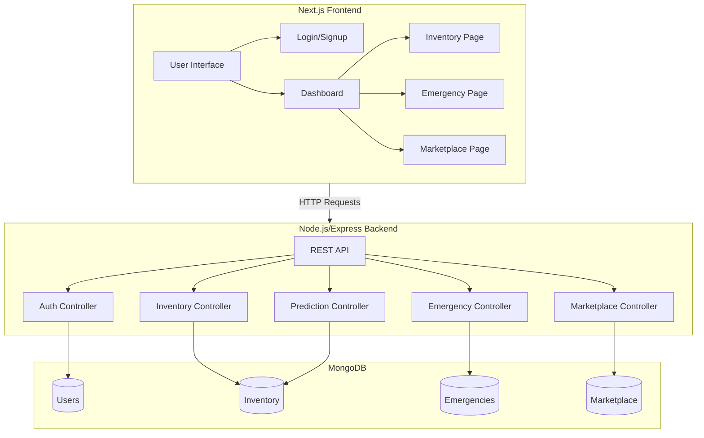
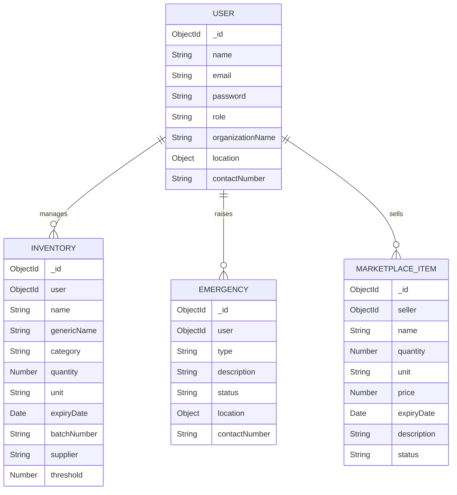

# ShasthoShetu

**Intelligent Medical Supply Forecasting & Emergency Support Platform**

ShasthoShetu ("Health Bridge") is an integrated digital platform designed to bridge gaps in the healthcare supply chain in Bangladesh. It provides predictive medical supply management, real-time stock visibility, emergency assistance, and an inter-hospital communication ecosystem.

## Features

- **Shortage Prediction Engine**: AI-driven forecasting to predict stockouts of essential medicines.
- **Real-Time Stock Visibility**: Track inventory levels across hospitals and pharmacies.
- **Emergency Assistance Module**: Broadcast urgent requirements (e.g., blood, oxygen) to nearby facilities.
- **Redistribution Marketplace**: Share or sell surplus inventory to reduce wastage.
- **Analytics Dashboard**: Role-based dashboard for hospitals, suppliers, and government authorities.

## Tech Stack

- **Frontend**: Next.js, TailwindCSS, Lucide React
- **Backend**: Node.js, Express.js, MongoDB, Mongoose
- **Authentication**: JWT, BCrypt

## Getting Started

### Prerequisites

- Node.js (v14 or higher)
- MongoDB (Local or Atlas)

### Installation

1.  **Clone the repository:**
    ```bash
    git clone https://github.com/yourusername/shasthoshetu.git
    cd shasthoshetu
    ```

2.  **Backend Setup:**
    ```bash
    cd server
    npm install
    # Create a .env file with PORT, MONGO_URI, and JWT_SECRET
    npm run dev
    ```

3.  **Frontend Setup:**
    ```bash
    cd client
    npm install
    npm run dev
    ```

4.  **Access the App:**
    Open [http://localhost:3000](http://localhost:3000) in your browser.

## Project Structure

- `/client`: Next.js frontend application.
- `/server`: Node.js/Express backend API.

## System Architecture



## Database Schema



## License

This project is licensed under the MIT License.
